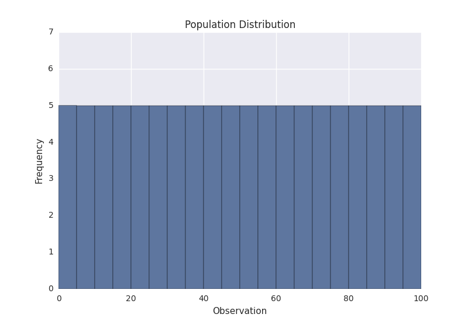

## Central Limit Theorem Demo
This project demonstrates the principles of the Central Limit Theorem by sampling a given input distribution 1000 times with a user specified sample size.

## Requirements
If plotting is enabled, [Matplotlib](http://matplotlib.org/) and [Seaborn](http://stanford.edu/~mwaskom/software/seaborn/) are required.

## Usage
The `central_limit_theorem_demo.py` file contains a `CentralLimitTheorem` class. It can be instantiated with a distribution in the form of a list.

```python
import central_limit_theorem_demo as clt

some_distribution = create_distribution(...)
cltDemo = clt.CentralLimitTheorem(some_distribution)
```

The demo can be run via the `run_sample_demo` method on CentralLimitTheoremDemo. This method takes a sample size `N`, a plotting flag `plot`, and an optional `num_bins` parameter describing the number of bins to use when plotting the demo output.

## Example
A full example might look something like this.

```python
import central_limit_theorem_demo as clt

def create_uniform_sample_distribution():
    return range(100)

def run():
    sampleDistribution = create_uniform_sample_distribution()

    # Plot the original population distribution
    clt.plot_distribution(sampleDistribution, "Population Distribution", 0, 100, 20)

    # Plot a sampling distribution for values of N = 2, 3, 10, and 30
    cltDemo = clt.CentralLimitTheoremDemo(sampleDistribution)
    n_vals = [2, 3, 10, 30]
    for N in n_vals:
        cltDemo.run_sample_demo(N = N, plot = True, num_bins = 40)
```

This produces the following output images.




```python

import random

class CentralLimitTheoremDemo(object):

    def __init__(self, distribution):
        self.distribution = distribution
        self.dist_min = min(distribution)
        self.dist_max = max(distribution)

    def _sample(self, N):
        sampleSum = 0
        for i in range(N):
            sampleSum += random.choice(self.distribution)
        return float(sampleSum) / float(N)

    def run_sample_demo(self, N , plot = False, num_bins = None):
        means = []
        for i in range(1000):
            means.append(self._sample(N))
        if plot:
            title = "Sample Mean Distribution with N = %s" % N
            plot_distribution(means, title , self.dist_min, self.dist_max, num_bins)
        return means

def plot_distribution(distribution, title = None, bin_min = None, bin_max = None, num_bins = None):
    import matplotlib.pyplot as plt
    import seaborn as sns
    sns.set_palette("deep", desat=.65)
    if num_bins != None:
        bin_size = (bin_max - bin_min) / num_bins
        manual_bins = range(bin_min, bin_max + bin_size, bin_size)
        [n, bins, patches] = plt.hist(distribution, bins = manual_bins)
    else:
        [n, bins, patches] = plt.hist(distribution)
    if title != None:
        plt.title(title)
    plt.xlim(bin_min, bin_max)
    plt.ylim(0, max(n) + 2)
    plt.ylabel("Frequency")
    plt.xlabel("Observation")
    plt.show()

```
