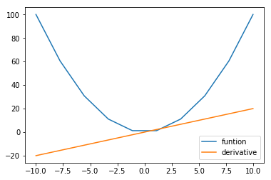
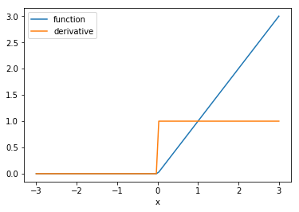

## Matrix

#### 1. What is the output of <code>a.size()</code> and <code>a.ndimension()</code> ?

 a = torch.tensor([[0,1,1],[1,0,1]])

Answer :
print(a.size())
print(a.ndimension())

torch.Size([2, 3])
2

#### 2. What is the mentioned cell?

a = [[1,2,3],[0,1,0]].
What is a[1][0:2]?

Answer :

[0,1]

#### 3. Assume we have two matrices. Matrix A has 2 rows and 3 columns. Matrix B has 3 rows and 1 column.

If C = A matrix multiplied B,

```
a = torch.tensor([[1,2,3],[0,1,0]])
print(a.size())
torch.Size([2, 3])

b = torch.tensor([[1],[2],[3]])
print(b.size())
torch.Size([3, 1])

```
**Answer :**
```
c = torch.mm(a,b)
print(c.size())
print(c)

torch.Size([2, 1])
tensor([[14],
        [ 2]])

```

## 2. Derivatives

####
```
x = torch.tensor(2.0,requires_grad=True)
y = x**2
y.backward()
x.grad
```
```
tensor(4.)
```

```
x = torch.tensor(2.0,requires_grad=True)
z = x**2 + 2*x + 1
z.backward()
x.grad
```
```
tensor(6.)
```

```
u = torch.tensor(1.0,requires_grad=True)
v = torch.tensor(2.0,requires_grad=True)
f = u*v + u**2
f.backward()
v.grad
```
```
tensor(1.)
```


# These are the libraries will be used for this lab.

```python
import numpy as np
import matplotlib.pyplot as plt
import torch
import pandas as pd

x = torch.linspace(-10,10,10,requires_grad=True)
Y = x**2
y = torch.sum(x**2)
y.backward()
plt.plot(x.detach().numpy(),Y.detach().numpy(),label='funtion')
plt.plot(x.detach().numpy(),x.grad.detach().numpy(),label='derivative')
plt.legend()
```



```python
import numpy as np
import matplotlib.pyplot as plt
import torch
import pandas as pd
import torch.nn.functional as F

# Take the derivative of Relu with respect to multiple value. Plot out the function and its derivative

x = torch.linspace(-3, 3, 100, requires_grad = True)
Y = F.relu(x)
y = Y.sum()
y.backward()
plt.plot(x.detach().numpy(), Y.detach().numpy(), label = 'function')
plt.plot(x.detach().numpy(), x.grad.detach().numpy(), label = 'derivative')
plt.xlabel('x')
plt.legend()
plt.show()

```



